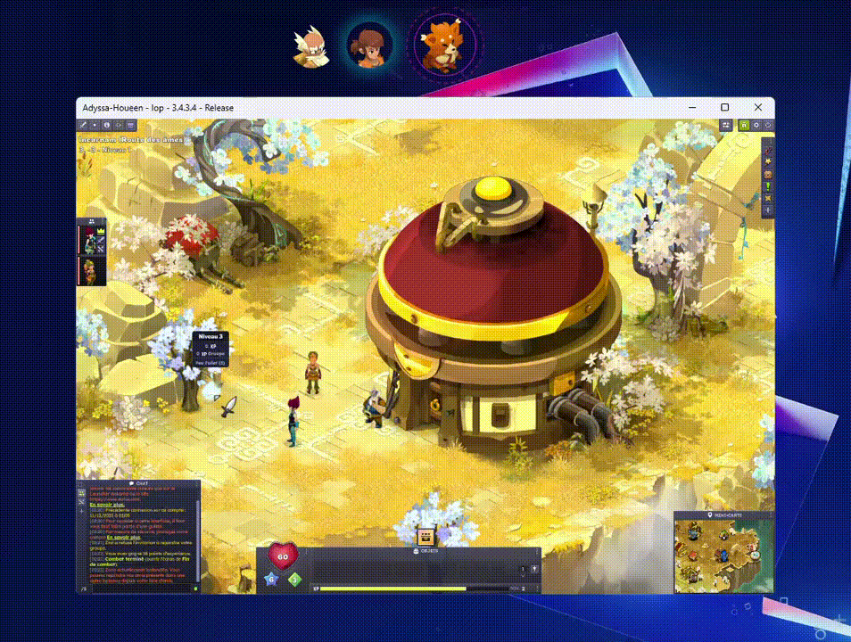

 
------------------------------------------------------------------------


# Organizer-Dofus 
  
 
------------------------------------------------------------------------

*(Windows-only)*

**Free & Open Source multi-character gameplay assistant for Dofus**

  

------------------------------------------------------------------------
  
## Illustration


 


------------------------------------------------------------------------

  

## Overview

  

**Organizer-Dofus** is a free, open-source tool created to make multi-account gameplay in Dofus simple, smooth, and efficient.

  
Whether you manage several characters, do quests, fight, explore, or coordinate a full team, Organizer-Dofus helps automate and organize the experience with a clean and intuitive UI.

  
##  Background

  

When Ankama released **Dofus Unity (Dofus 3)**, the community was excited for a modern but **STABLE** update of the game. Unfortunately, the early versions suffered from UI bugs, outrageous performance issues, and missing quality/effeciency in UI. Ankama later acknowledged these problems and shifted toward a more player-focused development approach.

One highly requested feature has been the **Hero Mode**, which become essential for many multi-account players.
While we wait for the official mode, **Organizer-Dofus** aims to make multi-character gameplay more comfortable and manageable.

## Features

- Easy and clean **Windows management** for multiple clients.

-  **Undetectable by design**

- No packet reading and network interception

- Uses only native Windows APIs

- Team Fight assistance

- Auto-join fights

- Auto-follow

- Auto-accept

- Auto-turn handling

- Quest helpers through auto clicks (Auto-dialog interactions etc...)

- Auto-accept and Auto-validate trades

- Auto-accept group invitations

- Record your own actions *(coming soon)*

- Support for **Dofus Retro**  *(coming soon)*

- Much more!
  

  
------------------------------------------------------------------------

  

## Installation & Usage

Organizer-Dofus relies on:

- [**Frida**](https://frida.re/) -- dynamic instrumentation
- [**MinHook**](https://github.com/TsudaKageyu/minhook) -- API hooking
- [**OpenCV**](https://github.com/opencv/opencv) -- frame processing

### OpenCV & MinHook Builds

The versions and release sources for OpenCV and MinHook can be customized using the following env variables:

- `MIN_HOOK_RELEASES` – URL for MinHook releases  
- `MIN_HOOK_VERSION` – Specific MinHook version to use  
- `MIN_HOOK_PATH` – Local path to a prebuilt MinHook (if available)  
- `OPENCV_VERSION` – OpenCV version to use  
- `OPENCV_RELEASES` – URL for OpenCV releases  

**Requirements:**  
- Node.js 20 or higher  
- C++ build tools (Microsoft Visual Studio 2022 or newer)

### Build (choose architecture)


``` bash
git clone "https://github.com/valyriaa/DofusOrganizer"
cd app/
npm install
npm run build:core:ia32
```

  
or

  

``` bash
git clone "https://github.com/valyriaa/DofusOrganizer"
cd app/
npm install
npm run build:core:x64
```


### Run the app

 
``` bash
npm start
```

  

------------------------------------------------------------------------

  

## Packaging

  

``` bash
npm run package:ia32
```

  

or

  

``` bash
npm run package:x64
```

  

------------------------------------------------------------------------

  

## Community

  

Feel free to open issues or PRs.

Questions? Join the community [**Discord**](https://discord.com/invite/organizer)

 
------------------------------------------------------------------------

  

## License
Organizer-Dofus is **free and open source**. Contributions are welcome!